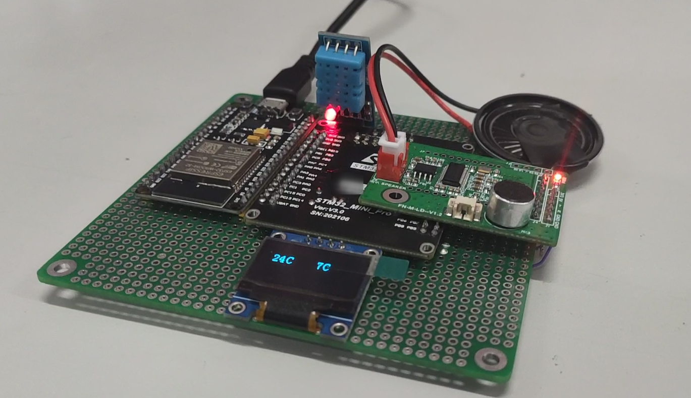
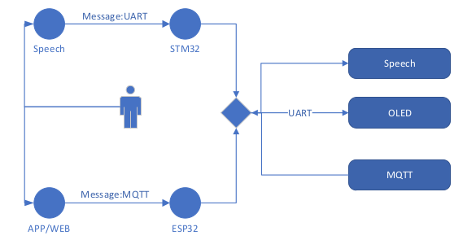
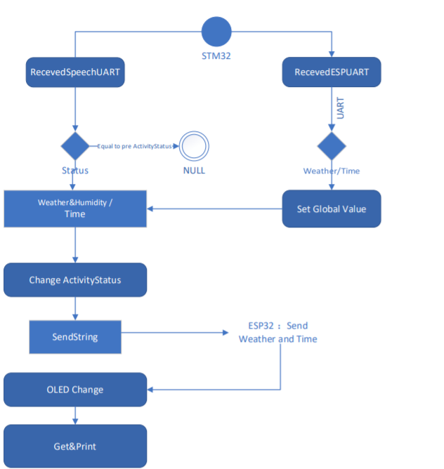

# Gulu
Hello, This is a STM32 Project for the beginner who want to connect the STM32 to the web using by ESP32 to build a mini voice assistant.

In this simple project, I have used these parts:
* STM32 RCT6 Dev board
* ESP32 NodeMCU
* DHT11
* Speech Recognition module(like LD3322)
* MQTT server
* 0.96 OLED

The main purpose of this design is to collect real-time temperature and synchronize it with the current network time.
The temperature and humidity sensor uses the DHT11 module, and these peripherals are connected to the STM32 through three serial ports.

The WiFi communication module uses the ESP32 module, and the microcontroller sends the temperature values collected by the temperature and humidity sensors to the ESP32 through the serial port, and sends them to the voice assistant for broadcast, and displays them on the OLED screen. 
The ESP32 then sends them to the personally deployed cloud server through the WiFi network using the MQTT protocol, and then connects to the remote monitoring through the MQTT server.

The same voice assistant  also cloud request the temperature and current time from the STM32.
